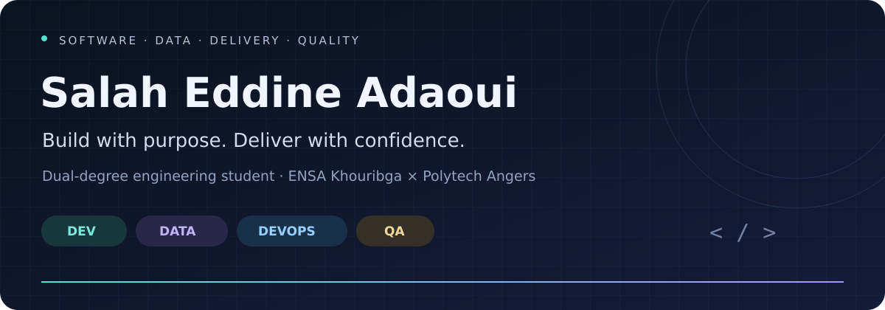
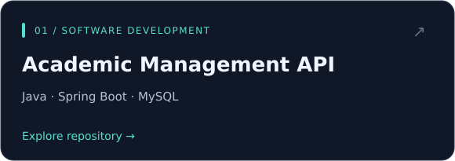
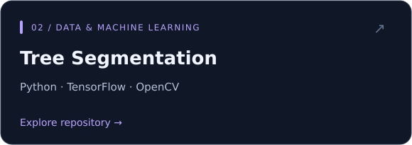
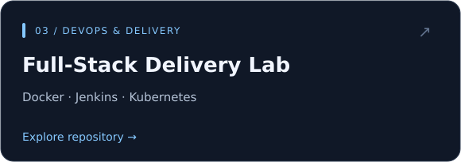
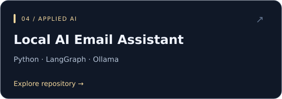

<b>Development &nbsp; / &nbsp; Data & AI &nbsp; / &nbsp; DevOps &nbsp; / &nbsp; Quality Engineering</b>

I connect software development, data experimentation and delivery practices with a focus on understandable, testable systems.

---

## About me

I'm **Salah Eddine**, a dual-degree engineering student at **ENSA Khouribga** and **Polytech Angers**, combining computer science and data engineering with quality, innovation and reliability.

My projects explore application development, machine learning and delivery automation. My professional experience in **functional testing and Web/API test automation** adds a quality perspective throughout that work.

## Four connected disciplines

| Development | Data & AI | DevOps | Quality Engineering |
| :--- | :--- | :--- | :--- |
| Java · Spring Boot | Python · TensorFlow | Docker · Compose | Cypress · Postman |
| React · TypeScript | OpenCV · scikit-learn | Jenkins · GitLab CI | Jira / Xray · Allure |
| REST APIs · MySQL | U-Net · local LLMs | Kubernetes labs | Functional & API testing |

*A mix of project technologies and professional experience; the repositories below show the concrete implementations.*

## Selected projects

<table>
<tr>
<td width="50%" valign="top">

Student, course and assessment management. Layered backend, REST endpoints and JWT components.

</td>
<td width="50%" valign="top">

U-Net for pixel-level satellite image segmentation. Preprocessing, training and prediction visualization.

</td>
</tr>
<tr>
<td width="50%" valign="top">

A React and Spring Boot containerization lab. Explore local deployment and delivery automation.

</td>
<td width="50%" valign="top">

A local agent for drafting emails in French. Contact lookup, user confirmation and SMTP delivery.

</td>
</tr>
</table>

## Quality throughout the lifecycle

My QA work brings together **functional test design**, **Web and API automation**, **CI integration** and **test reporting**. I also explore how local AI tools can help structure requirements and proposed test cases, with human review remaining part of the process.

## Education

**ENSA Khouribga** — Computer Science & Data Engineering  
**Polytech Angers** — Quality, Innovation & Reliability  
*Dual-degree pathway · currently completing my engineering studies.*

---

<b>Build it. Understand it. Test it. Improve it.</b> Software engineering through four complementary perspectives.

